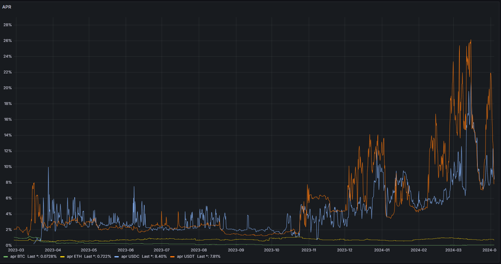
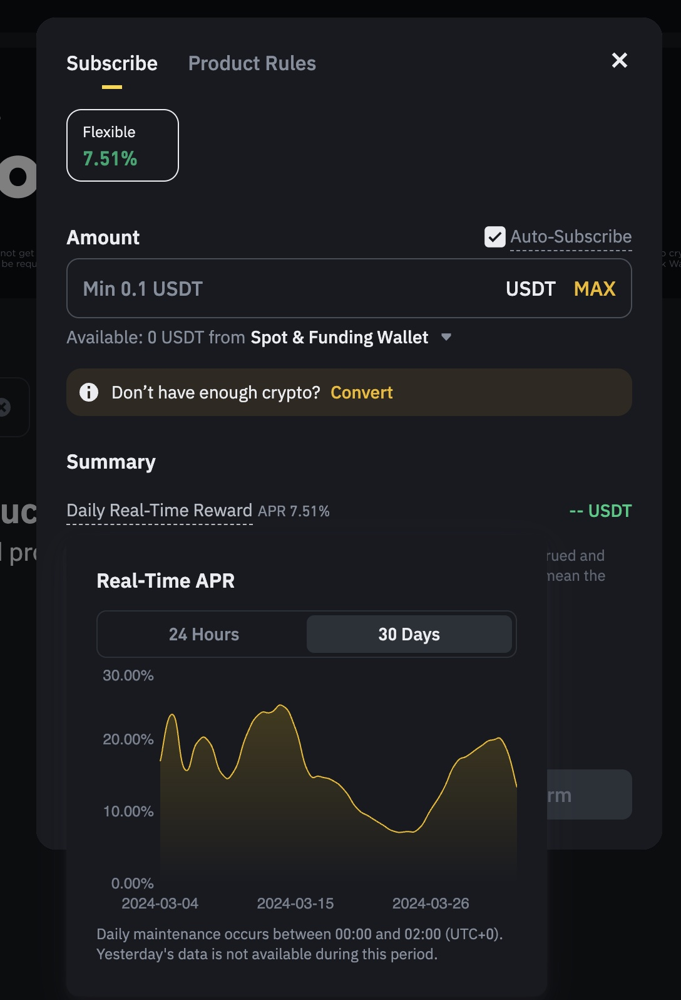
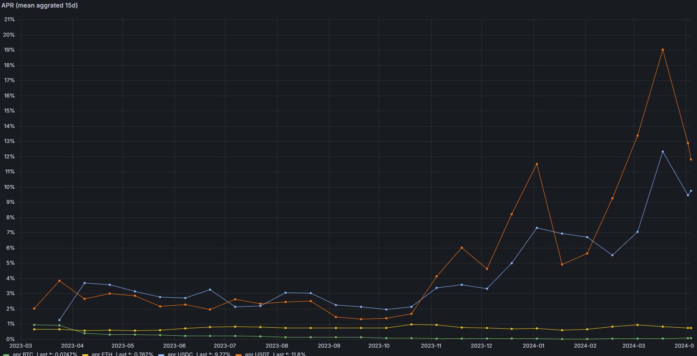

# Binance APR Monitor

This is a quick and dirty script to get APR (Annual Percentage Rate) of Binance Earn products and push it to InfluxDB.



## Motivation

I want to know if the APR of Binance Earn products is really worth it. As the price can change rapidly. I may put the results in the readme later.



## Analysis
The most interesting data is when the data is aggrated over 15d by mean. It gives a nice view if the APR are interesting or not for a short period.



## How to use

```
poetry install
poetry run python main.py
```

## Note

.envrc.example file is generated from .envrc using `cat .envrc | sed  's/".*"/""/g' > .envrc.example`.
